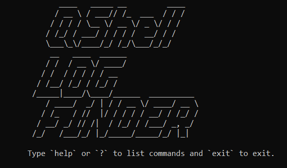
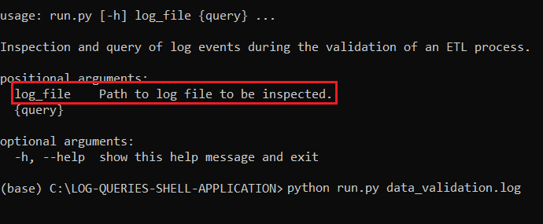
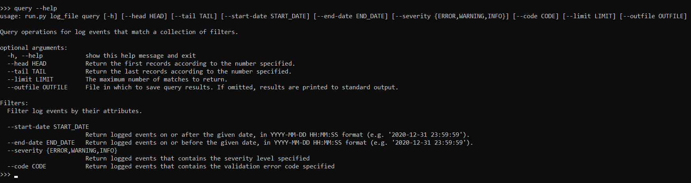

<h1 align="center">CLI Tool for Query Logged Events.</h1>

   
  
    
  <i>QShell is an interactive command-line interface tool that provides support for a user to query logged events generated during the validation phase of the data extracted by an ETL process.</i>
   

  
    

# _Table of Contents_

- [Introduction](#intro)
- [Installation](#install)
- [Technologies](#techno)
- [How it works](#usage)
- [License](#license)

 

# Introduction

# Installation
To run the application the `python` interpreter need to be installed. Download or clone the repo and that's it.  
The interactive shell is launched from the `run.py` script. You can refer to "How it works" section for further information on the usage of the application.

# Technologies
- Python 3.10.1

# How it works

The application performs user's queries on logged events which are loaded from a log file. Then before to run the interactive shell a log file name must be provided to be loaded by the application. The application read and write all files from the "data" folder, so a file needs to be loaded the file has to be put in the "data" folder.  
 

 

All search criteria for query the logged events use a subcommand called "query". Typing the subcommand and --help the man page is displayed on the screen.

 

 

---

# License
### MIT